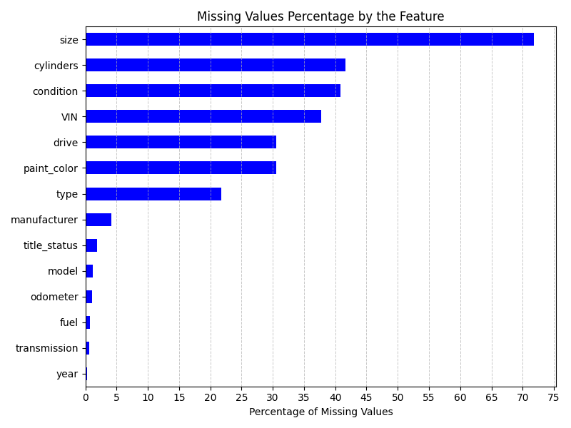
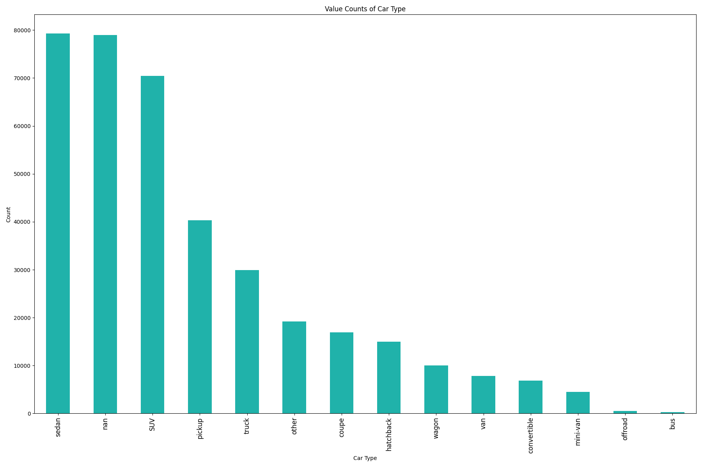
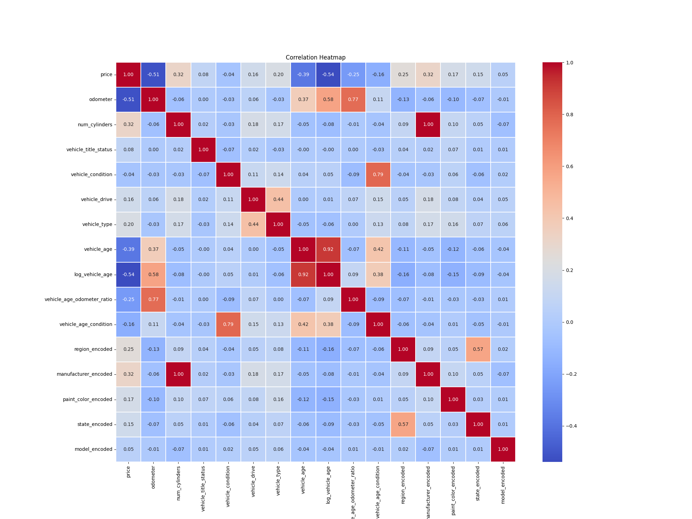
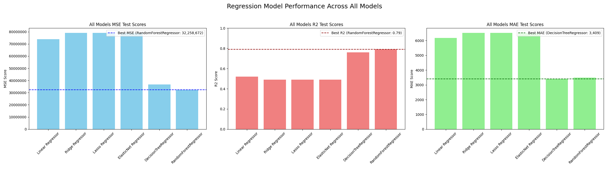

# Assignment 11.1 - What Drives the Price of a Car?

## Business Understanding
In this application, we are exploring the used car value dataset from Kaggle.The provided dataset contains information on 426K cars to ensure speed of processing. Our goal is to understand what factors make a car more or less expensive. As a result of our analysis, we should be able to provide recommendations to our client -- a used-car dealerships -- as to how to market the used cars.

## Data Understanding

Understanding the data set is a critical first step in any data science or machine learning project. This phase involves collecting, describing, and exploring the data to discover key patterns, relationships, and any other data issues.

Key Tasks

Data Description:- Summarize the dataset variable types, missing values, basic statistics (mean, median, etc.).

Data Exploration:- Use visualizations (histograms, scatter plots, correlation matrices) to identify patterns, trends, or anomalies.

Data Quality Checks:- Detect and handle missing, duplicated, or inconsistent entries to ensure reliability.

## Key features influencing car price:

- **Manufacturer & Model**: Impacts price through brand reputation and demand.
- **Year**: Newer cars are generally more expensive.
- **Odometer**: Higher mileage usually lowers price.
- **Condition**: Quality of the car (e.g., excellent, good, fair).
- **Fuel Type**: Varies in price based on fuel type (gasoline, electric).
- **Engine Type**: More powerful engines may lead to higher prices.
- **Cylinder**: Affects fuel efficiency and performance.

## Exploratory Data Analysis (EDA)
EDA uncovers trends, correlations, and outliers, providing insights into influential features for predicting car prices.

### Missing Value Overview
To better understand the completeness of our dataset, we visualized the missing values across key features:

**Summary**
1) Dataset size is 426880 X 18.
2) Many columns have missing values.
3) Size column have ~72%+ values missing.

**Summary of Data Preparation & Feature Engineering**

* Drop id column, as it is not useful for our analysis.
* Drop size column as ~72% of the values are missing.
* Apply VIN based imputation for year, make, model and vehicle type columns using python library (vin)
* Droped rows with NaN values.
   + Year Column: 1205 rows
   + Odometer Column: 4331 rows
   + Model Column: 5195 rows
   + Manufacturer Column: 16266 rows
* Observed outliers in price column.
  + We used IQR to remove outliers from price column.
  + Impute zero value of price with median when condition != NaN and title_status != Nan
  + Drop rows where price=0 and (condition=nan or title_status=nan)
* Removed outliers above 99 percentile for price and odometer columns.
* Convert year column data type from float to integer.
* Transform cylinders by adding a new numeric column(num_cylinders).
  + Initialize num_cylinders colums with 0.
  + Assigned corropspnding numeric value of cylinders to num_cylinders column.
  + Set NaN for cylinders type of 'Other'. Used make, model and vehicle type to impute cylinders with NaN value.
  + Set num_cylinders for elctric vehicles to 0
* Performed ordinal encoding for below columns
  + title_status
  + condition
  + type
  + drive
* Added new columns based on features interaction
  + vehicle_age: Absolute age of the vehicle in years.
  + log_vehicle_age: Vehicle does not decline linearly. So, log of age represents depreciation more accurately.
  + vehicle_age_odometer_ratio: (Vehicle wear rate) Ratio of odometer and vehicle age ratio
  + vehicle_age_condition: Helps identify if older cars are in surprisingly good/bad condition.

### Understanding Data via visualization

### Correlation Heatmap
We generated a heatmap to visualize the correlation between numerical features and identify relationships that could influence car pricing:

## Modeling

* Split first data set into train and test set using scikit-learn train_test_split() method
* Trained 7 types of models based on different regression algorithms.
  * LinearRegression
  * Ridge Regression
  * Lasso Regression
  * ElasticNet
  * HistGradientBoostingRegressor
  * DecisionTreeRegressor
  * RandomForestRegressor

## Evaluation

## Model Evaluation
Evaluate the model with:
- MSE (Mean Squared Error)
- R-squared Test scores
- MAE (Mean Absolute Error)

---

## Model Performance Summary
We compared multiple regression models using **Mean Squared Error (MSE)**, **MAE (Mean Absolute Error)** and **R² Test Scores** to evaluate performance.

### Best Model

Highlighted Results
* The best overall MSE was achieved by RandomForestRegressor, with an MSE of approximately 32.2 million.
* The highest R² Test score was also obtained by RandomForestRegressor, with a score of 0.79.
* The best overall MAE score was achieved by DecisionTreeRegressor, with a score of 3374

